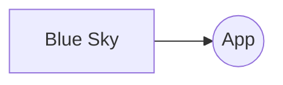

# Project to consume Blue Sky API with spring boot

## Description

## Tech
    - Java 21
    - Spring Boot
    - Maven

## The application has health check
## The application has a swagger documentation
    - The swagger documentation is available [here](http://localhost:8080/myapp/v3/api-docs)
    - and swagger ui is available [here] (http://localhost:8080/myapp/swagger-ui/index.html)

Design

