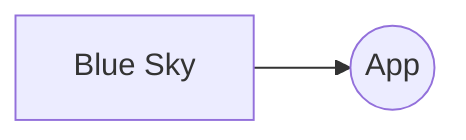

# Project to consume Blue Sky API with spring boot

## Description

## Tech
    - Java 21
    - Spring Boot
    - Maven

## The application has health check
## The application has a swagger documentation
    - The swagger documentation is available [here](http://localhost:8080/myapp/v3/api-docs)
    - and swagger ui is available [here] (http://localhost:8080/myapp/swagger-ui/index.html)

## You can add your password and handle to the application by adding the following lines to the application-private.properties file
    1 - create a file called application-private.properties in the resources folder
    2 - add the following lines to the file
    blueSky.password=your_password
    blueSky.handle=your_handle

Design

